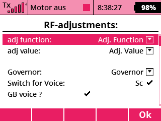
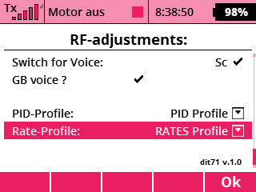
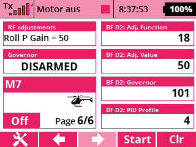
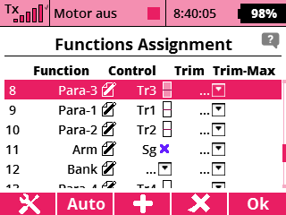
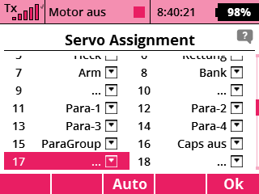
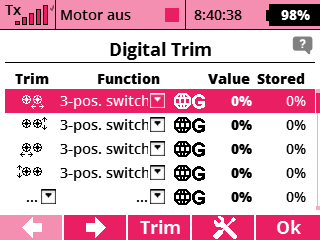

# RF_adjust
Voice output in Jeti transmitter of Rotorflight Governor state and Rotorflight adjustments  

# Installation:      
Copy the file "RF_adjust.lua" and the folder "Rotorflight" in the "/Apps/" folder of the transmitter   

If you are using a different language than Englisch or German, you have to create new folders in the "/Rotorflight" Directory with the corresponding ending like "_cz", "_fr", "_pt".
There you put your files, but make sure the filename is the same than the englisch ones.  
If you are just using one language you will need just the "adjfunc_" and the "governor_" folder, if you are using more languages you have to copy all folders which you are using.

# Configuration:
  
If voice output always should be ON you can also use the logical switch "Log.MAX", than you can spare a switch.

  
If you are just using the voice output or the telemetry screen you can ignore the settings of the PID-Profile or the Rate-Profile, but I would recommend it,
because the app will store every changed function value depending on the active PID-Profile or Rate-Profile in a Global lua Table called "Global_adjTable", and after you shut down the receiver it will convert the table in a json file and save it in the /models folder. Be sure you shut down the rx before the tx!
Of course if you change some settings in the rotorflight app, the json file will not be up to date.

# Telemetry window:
  
You get two telemetry windows, one for the governor and one for the RF-adjustments

# Example how to setup the Jeti Transmitter:
There are many ways how to setup the Tx to change the the Rotorflight values, as an example I try to describe how I did it.
Normaly with a FBL unit you don't need the Trim Buttons, so I'm using them to change the values. 
In this description I use them to change the PID values.
To change more than 4 values I set up a combination of a 2-point and a 3-point switch, so you could change at the most 2x3x4 = 24 values.
In my example I just use them to change 18 values, and you can change them individual for every PID-Rate, so in my case I have setup 4 PID-Rates, which are in total 4*18 = 72 values which I would be able to change.  

  
  

  

  

# Example how to setup Rotorflight:

