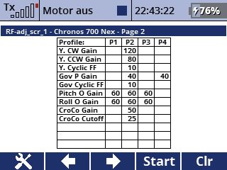

# RF_adjust
Voice output in Jeti transmitter of Rotorflight Governor state and Rotorflight adjustments  

# Installation:      
Copy the file "RF_adjust.lua" and the folder "Rotorflight" in the "/Apps/" folder of the transmitter   

If you are using a different language than Englisch or German, you have to create new folders in the "/Rotorflight" Directory with the corresponding ending like "_cz", "_fr", "_pt".
There you put your files, but make sure the filename is the same than the englisch ones.  
If you are just using one language you will need just the "adjfunc_" and the "governor_" folder, if you are using more languages you have to copy all folders which you are using.

# Configuration:
  
If voice output always should be ON you can also use the logical switch "Log.MAX", than you can spare a switch.

  
If you are just using the voice output or the telemetry screen you can ignore the settings of the PID-Profile or the Rate-Profile, but I would recommend it,
because the app will store every changed function value depending on the active PID-Profile or Rate-Profile in a Global lua Table called "Global_adjTable", and after you shut down the receiver it will convert the table in a json file and save it in the /models folder. Be sure you shut down the rx before the tx!
Of course if you change some settings in the rotorflight app, the json file will not be up to date.

# Telemetry window:
  
You get two telemetry windows, one for the governor and one for the RF-adjustments

# Example how to setup the Jeti Transmitter:
 An example how I did it do you find in the 

# Example Jeti configuration file:
I have add the 0001M7.jsn file, which is my Jeti configuration file from my DC-24 for the M7 (Mode 1). You can use the file either in JETI-Studio or maybe also in your transmitter.

# RF_adj_scr_1 app:
This app displays all your changed values in Rotorflight on the telemetry screen on your transmitter.  
The values you are changed during the flight are displayed in red.  
  
Just copy "RF_adj_scr_1.lua" in the "/Apps/" folder of the transmitter.  
  
You can adjust a few things:  

Example with 2 columns:  

Example with the two columns split on two telemetry pages:  
  
  

# dbdis:
If you are using my dbdis App in Jeti, then you can add a field with the governor state:  
  

    
(My english is not the best, so if someone will be interested to improve the readme, please go for it)

